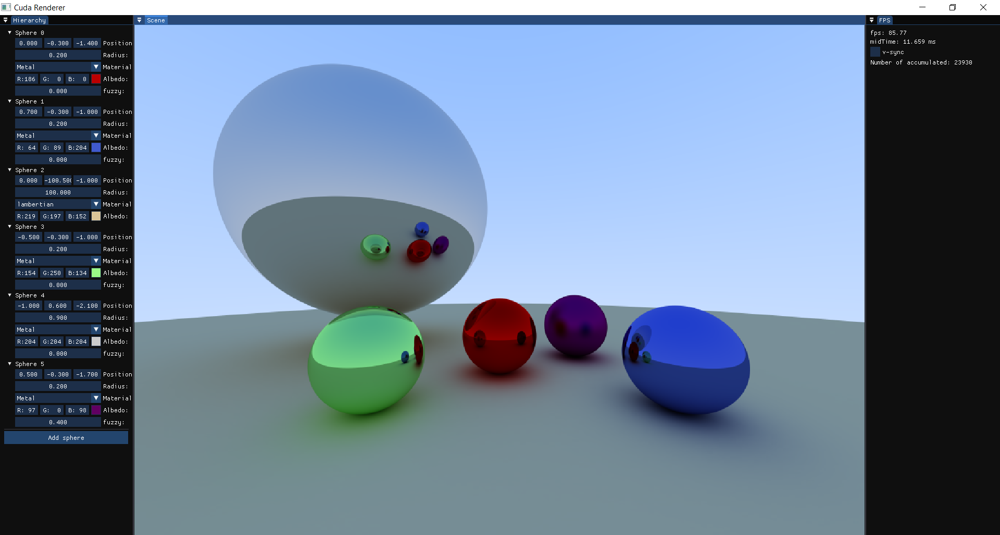

## Real-Time Ray Tracing with CUDA

This project implements real-time ray tracing using CUDA, base on [RayTracingInOneWeekend](https://raytracing.github.io/books/RayTracingInOneWeekend.html) and [Accelerated Ray Tracing in One Weekend in CUDA](https://developer.nvidia.com/blog/accelerated-ray-tracing-cuda/)
 to maximize computational efficiency. It integrates OpenGL interop for direct real-time result visualization.

    

## Features
- **High-Performance:** Provides high-performance rendering (FPS>80 on 1050-ti) 
- **Interactive interface:** Utilizes [ImGui](https://github.com/ocornut/imgui) to enable real-time manipulation of object properties, such as position, material, and color, during rendering. Users can also add new objects dynamically during rendering.

## Usage
Open the solution file in Visual Studio

